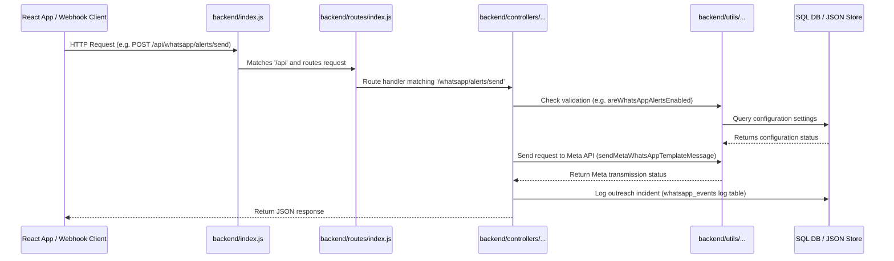

# 🩸 Fast Forward India - Blood Donation Automation Backend

This directory houses the Node.js & Express.js backend services responsible for blood group matching, cohort-based filter exclusions, programmatic outreach dispatch, and operators auditing logs.

The codebase is organized using a modular MVC-style controller-routing architecture.

---

## 📂 Project Directory Structure

```text
backend/
├── config/                  # Global system configuration
│   └── whatsapp.js          # Loads & validates Meta WhatsApp Cloud API credentials
│
├── controllers/             # Core business and route handler logic
│   ├── donorController.js   # Handles roster uploads, excel parses, and exclusions
│   ├── managerController.js # Handles manager promotions, deactivations, and logs
│   ├── volunteerController.js # Handles volunteer register, logins, and removal logs
│   └── whatsappController.js # Handles alert triggers, webhook status updates & retries
│
├── db/                      # Database configuration & validation routines
│   ├── knex.js              # Initializes the Knex query builder
│   └── database.js          # Verifies table schemas and runs seeds programmatically
│
├── migrations/              # Knex SQL schema migration files
│
├── models/                  # File-based and database model utilities
│   ├── store.js             # Read/write routines for JSON backups (roster & primary seed)
│   └── students.js          # SQL database helper rules for query checks
│
├── routes/                  # Express route paths mapping
│   ├── authRoutes.js        # Logins and forgot-password endpoints
│   ├── donorRoutes.js       # Roster imports, clears, and block filters
│   ├── managerRoutes.js     # Manager panels, user promotions, and audit feeds
│   ├── whatsappRoutes.js    # Outbound outreach dispatchers and Meta webhook endpoints
│   └── index.js             # Combines sub-routers into a unified router module
│
├── seeds/                   # Knex seeding scripts (default students, volunteers)
│
├── storage/                 # Directory containing local JSON storage databases
│   ├── active-donor-sheet.json  # Backs up current student donor rosters
│   └── manager-account.json     # Backs up the primary manager account details
│
├── index.js                 # Clean entry point that initiates database validations
├── knexfile.js              # Relational SQL connectivity configuration (MySQL)
└── package.json             # Backend dependencies and launch scripts
```

---

## 🛠 File & Folder Descriptions

### 1. Configuration (`config/`)
*   **`whatsapp.js`**: Fetches environment credentials (Access tokens, phone numbers, verify tokens) and extracts lists of missing variables if the API requires setup.

### 2. Controllers (`controllers/`)
*   **`donorController.js`**: Parses and normalizes incoming student rosters, writes matching active pools to local store backups, and syncs block lists.
*   **`managerController.js`**: Enables manager accounts promotion/demotion, toggles WhatsApp alert settings, and retrieves operational audit log streams.
*   **`volunteerController.js`**: Handles credential registration/validation loops for operators and manages automatic email notifications when volunteers are added or removed.
*   **`whatsappController.js`**: Coordinates outgoing template triggers, structures incoming webhook responses (Yes / No reasons), and handles event updates.

### 3. Database & Drivers (`db/`)
*   **`knex.js`**: Bootstraps connection parameters from `knexfile.js` to create the query client instance.
*   **`database.js`**: Boot check script executing table schema updates (for `managers`, `whatsapp_events`, `volunteers`, `manager_logs`) to keep database structures consistent across instances.

### 4. Mock Models & Flat Storage (`models/`)
*   **`store.js`**: Encapsulates atomic reads and writes to flat JSON file databases. Safely creates initial empty files if they are not already present on disk.
*   **`students.js`**: Implements eligibility algorithms verifying cohort rules, donation statuses, and last outreach timestamps.

### 5. Routing Interfaces (`routes/`)
*   **`authRoutes.js`**: Maps login, request-reset, and confirm-reset operations for both managers and volunteers.
*   **`donorRoutes.js`**: Exposes endpoints to search, import, reset, or filter the student donor dataset.
*   **`whatsappRoutes.js`**: Registers paths for Meta API outbound triggers, logs, retries, and webhook listeners.
*   **`managerRoutes.js`**: Mounts operator configuration changes and management actions.
*   **`index.js`**: Central aggregator that registers all endpoint routes onto the `/api` prefix.

---

## ⚙️ How It Works (The Routing Lifecycle)



---

## 🚀 Installation & Local Launch

Ensure that you have configured your environment variables in `.env` inside the `backend` folder as described in the root `README.md`.

### 1. Install Dependencies
```bash
npm install
```

### 2. Initialize Database
Create your schema tables and seed baseline data:
```bash
npx knex --knexfile knexfile.js migrate:latest
npx knex --knexfile knexfile.js seed:run
```

### 3. Run Server
*   **Production mode**:
    ```bash
    npm start
    ```
*   **Development mode** (runs via Nodemon and auto-restarts on code edits):
    ```bash
    npm run dev
    ```
